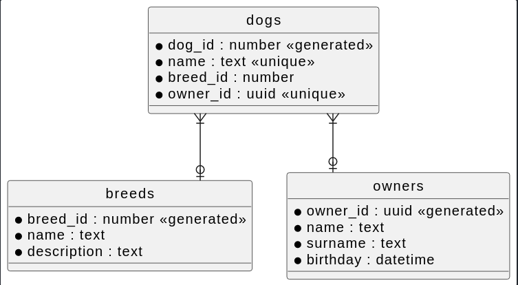

# Create a REST API

Just a simple rest example in Go with PostgreSQL to test some stuff

## Installation

You need to have installed [docker](https://docs.docker.com/engine/install/ubuntu/) and [docker-compose](https://docs.docker.com/engine/install/ubuntu/).

`docker-compose up --build`

## DB schema

## Swagger 3.0

[here](./here)

## Uninstall

`docker-compose down --volumes`
